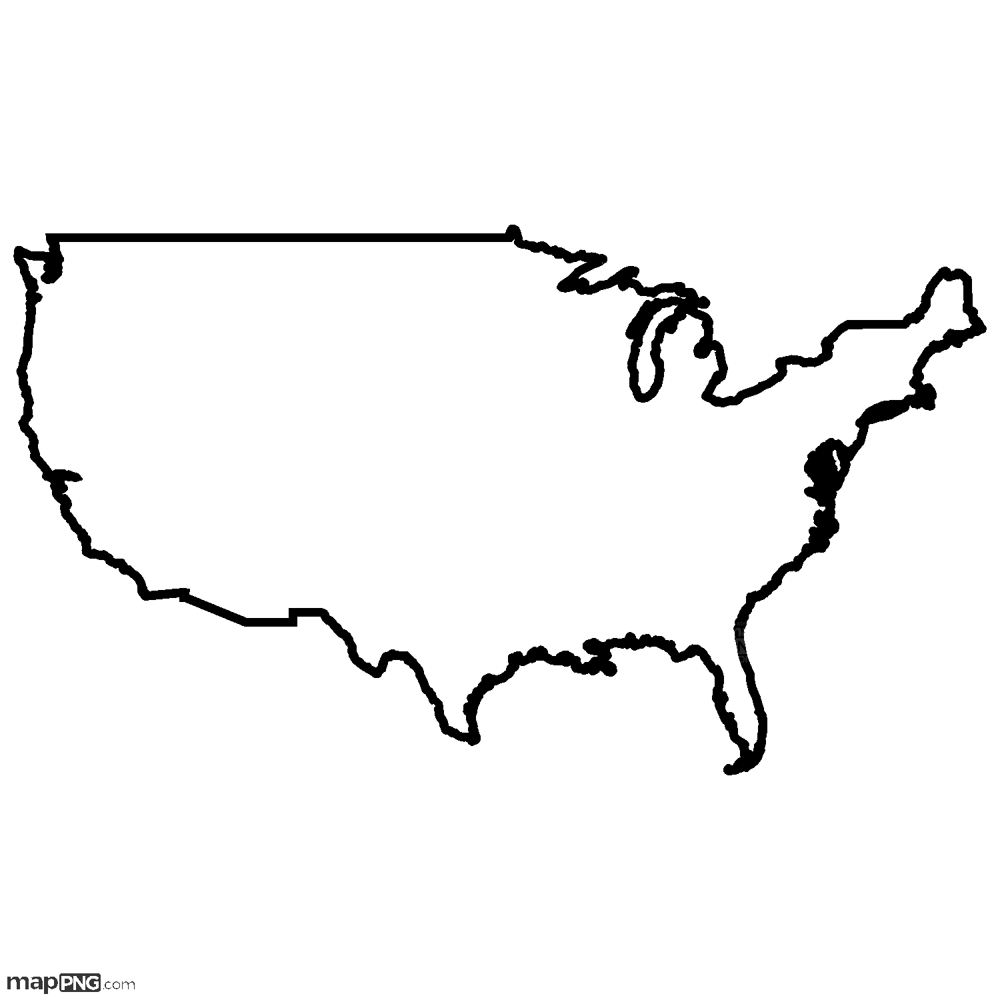

# Nonparametric Regression on Iran Map Shape

## Project Overview
This project demonstrates nonparametric regression methods applied to spatial data by extracting the outline of Iran’s map from an image. Using spline and kernel regression techniques, it models the relationship between coordinates and visualizes the fitting performance.

## Key Features
- Image processing to extract Iran’s map boundary points  
- Application of linear, kernel, and spline regression models  
- Visualization of regression results with scatter and fitted curves  
- Quantitative evaluation using MSE, MAE, Correlation, AIC, and BIC  

## Installation
Make sure you have Python 3.x installed, then install the required packages:

## Sample Input Image

This is the outline of the United States used for contour extraction and nonparametric regression modeling.



```bash
pip install numpy pandas matplotlib opencv-python scipy scikit-learn


